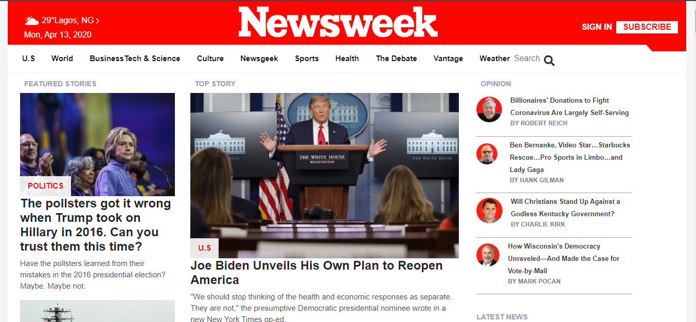

# Newsweek
> This project is a clone of Newsweek.com homepage,It makes use of Bootstrap.This was completed as part of the Microverse remote software developement curriculum using the pair programming approach. Content of the webpage is copied from [that](https://www.Newsweek.com) original page.

## Built With

- HTML,
- CSS,
- Bootstrap

## Live Demo

[Live Demo Link](https://raw.githack.com/evansinho/Newsweek/newsweek-clone/index.html)

### Prerequisites

-Any kind of browser supporting CSS3 and HTML5

### Setup

-Fork the repo to your remote repository.
-Clone or download the repository to your local machine.

### Install

-No istallation needed.

### Usage

-Visit the live demo link on your web browser.

## Authors

👤 **Evanson Igiri**

- Github: [@githubhandle](https://github.com/evansinho)
- Twitter: [@twitterhandle](https://twitter.com/iamsinho1304)
- Linkedin: [linkedin](LinkedIn.com/in/evanson-igiri)
- Email: [evanson](mailto:igiri.evanson@gmail.com)

## 🤝 Contributing

Contributions, issues and feature requests are welcome!

Feel free to check the [issues page](https://github.com/evansinho/Newsweek/issues).

## Show your support

Give a ⭐️ if you like this project!

## Acknowledgments

- TheOdinProject.com PROJECT: BUILDING WITH RESPONSIVE DESIGN
